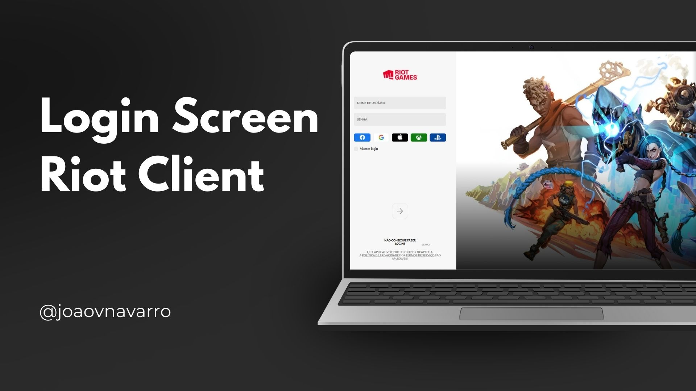

<h1 align="center"> Tela de Login Riot Client </h1>
 

  <a href="#-tecnologias">Tecnologias</a>&nbsp;&nbsp;&nbsp;|&nbsp;&nbsp;&nbsp;
  <a href="#-projeto">Projeto</a>&nbsp;&nbsp;&nbsp;&nbsp;&nbsp;&nbsp;

 

  

## 🚀 Tecnologias

Esse projeto foi desenvolvido com as seguintes tecnologias:

- HTML e CSS
- Git e Github

## 💻 Projeto

Este projeto consiste em uma página web, em versão desktop, desenvolvida com o objetivo de recriar a tela de login do client da Riot Games. A proposta é reproduzir fielmente o visual e a experiência da interface original, respeitando o design e a identidade da Riot, mas com todo o código estruturado e desenvolvido por mim do zero, como forma de prática e aprimoramento das minhas habilidades em desenvolvimento front-end. Além da tela de login, o projeto também conta com uma página adicional reunindo os créditos e informações sobre o próprio projeto.  
- <a href="https://joaovnavarro.github.io/riot-login-screen-project/" target="_blank">Acesse o projeto finalizado, online</a>

Codado com  pelo <a href="https://github.com/joaovnavarro" target="_blank">Jv</a>

---